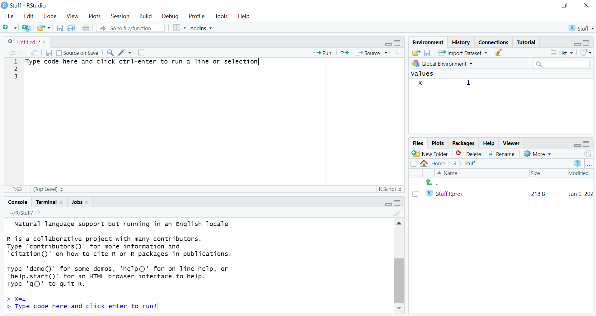
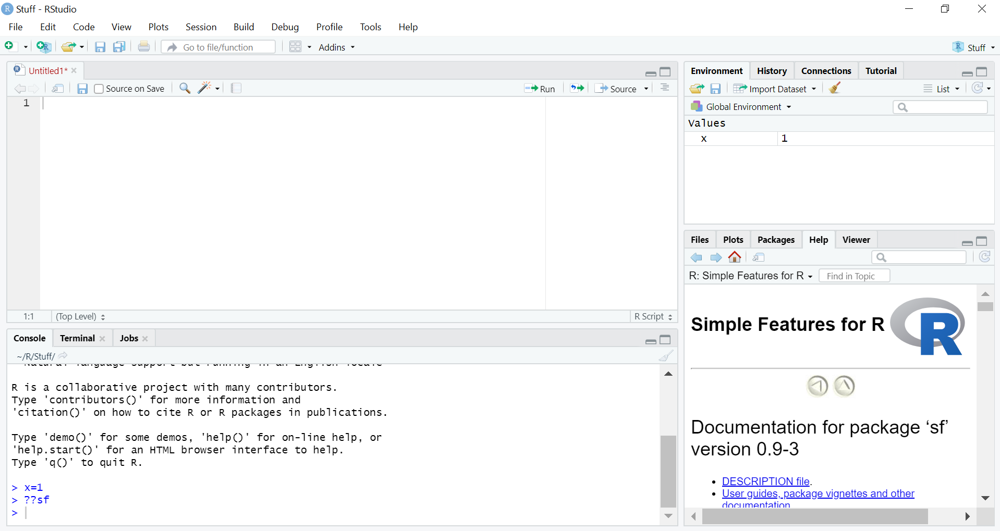

We do alot of spatial stuff in the oil and gas industry.  Unfortunately, we do alot of it by hand.  This wastes time, introduces human error, and leads to unrepeatable analysis.  Fortunately it doesn't have to be this way!  In fact, if you can describe a spatial process you want done to a person, you can probably code it up so a computer can do it.  I do this all the time with everything from well spacing calculations to creating operatorship maps.  In this talk, I'm going to show you how to do a quick and dirty well density calculation using my preferred tool: the sf package in R.

SF stands for "Simple Features" and it is a relatively new R package.  Simple features are basically just a condensed way to describe shapes from points to lines to polygons.  The package lets you do basic GIS functions with these features like transform coordinates, intersect shapes, calculate distances, and create buffer polygons.

It's probably easier to just show you a few things it can do and hopefully that will give you a flavor of what's possible so you can explore more on your own.  Let's get started!  

<center>

</center>
\newline
\newline
First, let's get into R using RStudio.  It's pretty simple.  We'll just install R and run it locally.  You just need to download [R](https://cran.r-project.org/) and [RStudio](https://rstudio.com/products/rstudio/download/).  After that open up RStudio.  Go to File > New Project > New Directory > New Project and create a new project.  Then go to File > New File > R Script.  You should be looking at something like this.



Base R is extremely useful, but like Python it's strength is a great repository of high quality packages.  While anyone can create an R package, the most popular packages are stored on the Comprehensive R Archive Network [(CRAN)](https://cran.r-project.org/).  Packages here can be easily installed like this:

```{r, install package, eval=FALSE}
install.packages('sf')
```

You only need to install packages once, or at least once every time you update R.  After that when you want to use a package, you can load it with the library function.  For this example we'll use the 'sf' package, which is a geospatial package for R.

```{r, load package, message=FALSE}
library(sf)
```

If you need help for a package, you can find the manual on CRAN or you can go to the "Packages" tab on the right-hand side, click your package, and it will come up.  You can also type ??*package name*.

```{r, get help, eval=FALSE}
??sf
```

You should see something like this in the help section on the right side:



If you need help with a specific function you can type ?*function name*

```{r, get function help, eval=FALSE}
?st_read
```

RStudio has alot more features, but to get going, that's about all you need to know.  

Let's get started with some analysis.  First, we'll download a free shapefile to work with.  In this case, the well spots and lines from the COGCC.  There's also some code in here to unzip it and then delete the zip file.

```{r, download wells, eval=FALSE}
link = 'https://cogcc.state.co.us/documents/data/downloads/gis/DIRECTIONAL_LINES_SHP.ZIP'
destination = paste0(getwd(), '/', basename(link))
download.file(url=link, destfile = destination, mode='wb')
unzip(destination, exdir=getwd())
unlink(destination)
```

Hopefully that works on non-Windows machines.  If not, just download and unzip the file like normal and put it in your current working directory.  Your working directory is the default place R looks for files.  Don't know your current working directory path?  Look it up with *getwd()*.  It should be the same place you started your project.

```{r, getwd}
getwd()
```

Now we'll import our shapefiles to R.  As you'll see, most of the function names in the sf package begin with *st_* and are pretty well named.  We'll use *st_read* to import the shapefiles.  You can see all the functions available in the [manual](https://cran.r-project.org/web/packages/sf/sf.pdf).

```{r, import shapefiles, message=FALSE}
wells = st_read(paste0(getwd(), '/Directional_Lines.shp'))
```

We now have a simple features collection (sfc) called wells.  Here's what the first 5 rows of it look like:

```{r, show well}
head(wells, 5)
```

If you've used R before, you'll notice it looks pretty much like a **data.frame**... and it is!  Filtering, merging, indexing, etc all behave just like a **data.frame**.  There are two differences.  One you can see the header at the top.  It contains the projection information which tells you what the coordinate system is.  The second is the **geometry** column.  Those are the simple features and in this case they contain all the information necessary to draw a well survey.  Because of that, we store the information for one well in only one line of a table!  No more needlessly repeating data hundreds of time because there's hundreds of rows in a directional survey... not that I've ever done anything like that...

Anyway, one of the first things you need to do when working with spatial data is to get everything on the appropriate projection.  We can see what projection is like this:

```{r, check projections}
st_crs(wells)$input
```

We can see they're in UTM Zone 13 NAD83.  Let's convert to Colorado Central State Plane coordinates.  To do that we need to need to know the EPSG number of the projection.  I usually look them up on [spatialreference.org](https://spatialreference.org/).  After that we use the appropriately named *st_transform* function.

```{r, transform coordinates}
wells = st_transform(wells, 26754)
```

Now, let's look at one well.  But not just any well of course.  Let's find the longest horizontal.  We can get the length of each feature with the *st_length* function.  Then we can use *which.max* to tell us the index of the longest one.  Finally we'll plot with the *plot* function which is available in base R.

```{r, plot well}
longest_well_index = which.max(st_length(wells))
plot(wells[longest_well_index, 'geometry'])
```

Looks like a number one!  Also looks like it's part of a pad.  How do we find its padmates?  If only we had some way to find the wells within a certain distance of another well...  For that, we'll use a couple functions.  First, the *st_buffer* function to make a polygon a mile around the well.

```{r, make buffer}
buffer = st_buffer(wells[longest_well_index,], dist=5280)
plot(buffer$geometry)
plot(wells[longest_well_index,'geometry'], add=TRUE, col='red')
```

Then we can use *st_intersects* to find the other wells that intersect that polygon.

```{r, get padmates}
ints = st_intersects(buffer, wells)
ints
```

st_intersects outputs a list the same length as the first argument.  Each element of list contains the indices of the other argument that intersect the first.  Using that, we can find and plot the wells that intersect the buffer polygon.

```{r, plot padmates}
plot(buffer$geometry)
plot(wells[ints[[1]], 'geometry'], add=TRUE, col='green')
plot(wells[longest_well_index,'geometry'], add=TRUE, col='red')
```

Excellent.  What if we want to drill our own pad?  Luckily we can make our own features.  First we'll make a small **data.frame** with the start and end coordinates of each location we want to add.  We'll also add a column that identifies which well each coordinate belongs to.

```{r, make wells}
longest_well_coords = st_coordinates(wells[longest_well_index,])
max_x = max(longest_well_coords[,1])
min_x = longest_well_coords[which.max(longest_well_coords[,2]),1]
min_y = min(longest_well_coords[,2])
max_y = max(longest_well_coords[,2])
x = c(max_x + 660, min_x + 660, max_x+1320, min_x+1320, max_x+1980, min_x+1980)
y = c(min_y, max_y, min_y, max_y, min_y, max_y)
id = rep(1:(length(x)/2), each = 2)
coords = data.frame(x,y,id)
coords
```

Then  we'll turn them into simple features by looping *st_linestring* with *lapply*.  Finally we'll set the coordinate reference system to be the same as the existing wells using *st_crs*. 

```{r, make well sf}
g = lapply(unique(id), function(i) st_linestring(as.matrix(coords[coords$id==i,c('x','y')])))
g = st_sf('geometry' = st_sfc(g))
st_crs(g) = st_crs(wells)

plot(buffer$geometry)
plot(wells[ints[[1]], 'geometry'], add=TRUE, col='green')
plot(wells[longest_well_index,'geometry'], add=TRUE, col='red')
plot(g$geometry, add=TRUE, col='purple')
```

If we want to add our new locations to the wells we can use *rbind*, although, we have to make sure they have the same number of columns first.  Also, this package is still pretty new.  I find that sometimes *rbind* doesn't work well and I have to force it to use the sf version of *rbind* directly.  You can access the internal (hidden) functions of a package using three colons like this *sf:::rbind.sf*.

```{r, join locs to wells}
g[,names(wells)[!(names(wells) %in% 'geometry')]]=NA
wells = sf:::rbind.sf(wells, g)
```

Now what if we want only the parts of the wells inside the buffer?  For that, we use *st_intersection*.  We'll check again which wells intersect our buffers first so we capture our newly created wells.

```{r, get intersection}
ints = st_intersects(buffer, wells)
wellInts = st_intersection(wells[ints[[1]],], buffer$geometry)
plot(buffer$geometry)
plot(wells[ints[[1]], 'geometry'], add=TRUE, col='green')
plot(wells[longest_well_index,'geometry'], add=TRUE, col='red')
plot(wellInts$geometry, add=TRUE, col='blue')
```

Don't worry about the warning.  When it intersects things it assumes that the other columns can be propagated from the first argument to the second.  It's just telling you that it's doing that.  If you don't want them to, then just limit the number of columns.  Or if it realllllly bothers you you can wrap it in the *suppressWarnings* function.

Anyway, now if we want to know the total length of offset wellbore within that polygon we can simply calculate the lengths and sum the up like so.  We'll divide by the average length of the intersected wells to turn it into more of a well density.

```{r, get length}
wellInts$length = as.numeric(st_length(wellInts))
length = sum(wellInts$length, na.rm=TRUE)
density = length/mean(wellInts$length, na.rm=TRUE)
density
```

But who just wants to know the density of just one well?!  Let's loop them all... well most of them anyway.  Using full directional surveys to do this is pretty intensive, so I'm just going to limit this to Wattenberg horizontals.  We'll also use *st_simplify* to reduce the number of points using a 20' tolerance.  Even then it takes awhile on my slow laptop (10 min or so).  I usually use two point well sticks and *parLapply* which allows you to use parallel processing to speed things up.  However in the name of simplicity let's just do this the slow way.

```{r, make density map, cache=TRUE, eval=TRUE}
wells = wells[wells$Deviation=='Horizontal' & !is.na(wells$Deviation), ]
wells = wells[wells$Field_Name=='WATTENBERG', ]
wells = st_simplify(wells, dTolerance = 20)
buffers = st_buffer(wells, dist=2640)
ints = st_intersects(buffers, wells)
getDensity = function(buffer, wellSubset){
  wInt = suppressWarnings(st_intersection(buffer, wellSubset))
  wInt$intersected_length = as.numeric(st_length(wInt))
  density = sum(wInt$intersected_length, na.rm=TRUE)/mean(wInt$intersected_length, na.rm=TRUE)
}
density = lapply(1:nrow(buffers), function(i) getDensity(buffers[i,], wells[ints[[i]],]))
density = do.call(c, density)
wells$density = density
plot(wells[,'density'])
```

<center>

</center>
  
  
And that's pretty much it!  There's obviously a lot more you can do, but hopefully that's enough to get you started exploring the sf package and automating some spatial tasks.  If you have any questions, send me an email at <donald.keighley@gmail.com> or hit me up on [Linkedin](
https://www.linkedin.com/in/donald-keighley-2698ba17a/).
  

